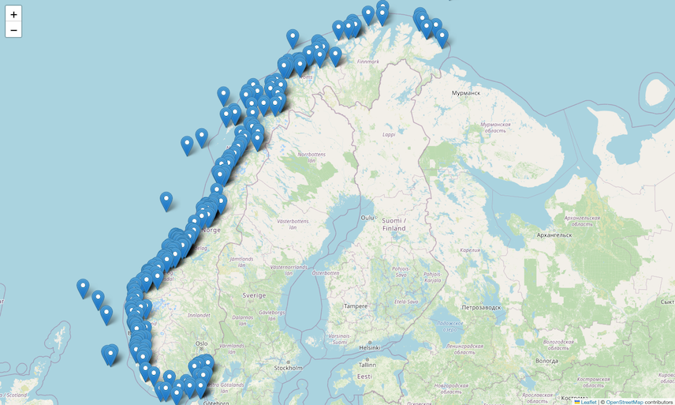

# kdb+tick for AIS capture

Runs a (simple) kdb+tick to ingest the Norwegian Coastal Administration AIS data, which is a live stream of AIS data from ships around Norway.

- Data source: https://www.kystverket.no/en/navigation-and-monitoring/ais/access-to-ais-data/
- Data license: https://data.norge.no/nlod/en/2.0

The example uses pyais to subscribe to and decode messages from the stream, and PyKX to stream them into the database.

- KX: https://kx.com
- kdb+tick: https://github.com/KxSystems/kdb-tick
- PyKX: https://docs.kx.com/3.1/PyKX/home.htm
- pyais: https://github.com/M0r13n/pyais

Works on macos & probably Linux.

## AIS message types

Two classes of messages are recorded - position reports telling us where the vessel is/where it's heading, and static data which tells us more information about who the vessel is.

- [Position reports](https://www.navcen.uscg.gov/ais-class-a-reports) - message types 1,2,3
- [Static and voyage related data](https://www.navcen.uscg.gov/ais-class-a-static-voyage-message-5) - message type 5

## Running

The all of the database processes (and the AIS feed) are started with `startdb.sh` and stopped with `stopdb.sh`

The scripts are orchestrated through & require `tmux`. You can connect to the DB services after startup with `tmux a -t "aiskdb"`. `C-b w` will then take you to the overview screen so you can browse through them. 

## Gateway functions

The following query functions are available on the gateway:

- `latest[]`  - get latest vessel states
- `positionHist[mmsi;startTS;endTS]` - get position history for `mmsi` between `startts` and `endts`
- `staticHist[mmsi;startTS;endTS]` - get static data history for `mmsi` between `startts` and `endts`

Examples of calling these via q are shown in `aisquery.kxnb`, and there is a Jupyter notebook `aisquery.ipynb` with Python examples.

## Architecture

- kdb+ Architecture Course: https://academy.kx.com/courses/kdb-architecture/
- kdb+ Architecture Course git repo: https://github.com/KxSystems/kdb-architecture-course
- kdb+ Streaming Architecture: https://code.kx.com/q/architecture/
- Chained tickerplants & RDBs: https://code.kx.com/q/kb/kdb-tick/
- RTEs: https://code.kx.com/q/wp/rt-tick/

